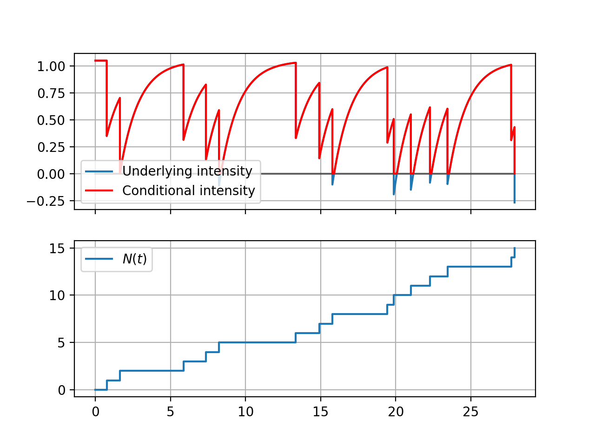

# MLE for Exponential Hawkes Process

Source code for [Inference of multivariate exponential Hawkes processes with inhibition and application to neuronal activity](https://hal.archives-ouvertes.fr/hal-03652497/) [[1]](#1). 

It includes a class to simulate an univariate Hawkes process and functions to compute the log-likelihood presented in the aforementioned paper along with the approximated version from Lemonnier's work [[2]](#2).

## Example

We include two examples of application, one for simple plotting with the ```exp_thinning_hawkes``` class, shown below, and another one implementing the algorithm of estimation with the ```estimator_class```.

```py
import numpy as np
from matplotlib import pyplot as plt
from code.hawkes_process import exp_thinning_hawkes

if __name__ == "__main__":

    # Set seed
    np.random.seed(0)

    lambda_0 = 1.05
    alpha = -0.7
    beta = 0.8
    
    # Create a process with given parameters and maximal number of jumps.
    hawkes = exp_thinning_hawkes(lambda_0=lambda_0, alpha=alpha, beta=beta, max_jumps=15)
    hawkes.simulate()
    
    # Plotting function of intensity and step functions.
    hawkes.plot_intensity()

    plt.show()

```
This example must yield the following plot:



## Dependencies

This code was implemented using Python 3.8.5 and needs Numpy, Matplotlib and Scipy.

For graphics/boxplots_errors.py, pickle is necessary though this is not at all required to use all functions and classes implemented in this repository.

## Installation

Copy all files in the current working directory.

## Author

Miguel Alejandro Martinez Herrera

## References

<a id="1">[1]</a>
A. Bonnet, M. Martinez Herrera, M. Sangnier, Inference of multivariate exponential Hawkes processes with inhibition and application to neuronal activity. arXiv:2205.04107 

<a id="2">[2]</a>
R. Lemonnier, N. Vayatis, Nonparametric markovian learning of triggering kernels for mutually exciting and mutually inhibiting multivariate hawkes processes, in: Machine Learning and Knowledge Discovery in Databases, Springer Berlin Heidelberg, 2014, p. 161–176
