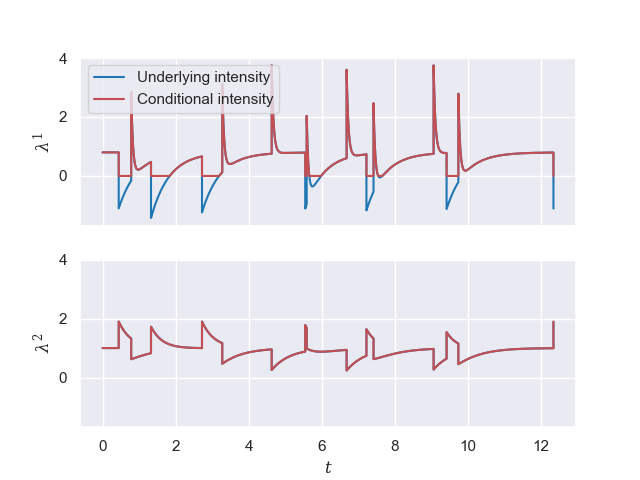

# MLE for Exponential Hawkes Process

Source code for [Inference of multivariate exponential Hawkes processes with inhibition and application to neuronal activity]([https://authors.elsevier.com/c/1dbhNc8a~AzOW](https://arxiv.org/abs/2205.04107)). 

It includes a class to simulate a multivariate Hawkes process and functions to compute the log-likelihood presented in the aforementioned paper along with the approximated version from Lemonnier's work [[1]](#1).

## Example

An example of simulation of a multivariate Hawkes process is shown below .

```py
import numpy as np
from matplotlib import pyplot as plt
from class_and_func.multivariate_exponential_process import multivariate_exponential_hawkes
import seaborn as sns

from matplotlib import rcParams

rcParams['font.family'] = 'serif'
rcParams["mathtext.fontset"] = "dejavuserif"

if __name__ == "__main__":
    # Set seed
    np.random.seed(3)

    dim = 2

    if dim == 2:

        mu = np.array([0.8, 1.0])
        alpha = np.array([[-1.9, 3], [0.9, -0.7]])
        beta = np.array([[2, 20], [3, 2]])

    alpha = np.abs(alpha)

    hawkes = multivariate_exponential_hawkes(mu=mu, alpha=alpha, beta=beta, max_jumps=15*(dim-1))

    # Create a process with given parameters and maximal number of jumps.

    hawkes.simulate()

    print(hawkes.timestamps[0], hawkes.timestamps[-1])

    sns.set_theme()

    fig, ax = plt.subplots(2, 1, sharey=True, sharex=True)

    ax[0].set_ylabel("$\lambda^1$")
    ax[1].set_ylabel("$\lambda^2$")

    ax[1].set_xlabel("$t$")
    hawkes.plot_intensity(ax=ax.T, plot_N=False)

    hawkes.plot_heatmap()

    plt.show()

```
This example must yield the following plot:



## Dependencies

This code was implemented using Python 3.10 and needs Numpy, Matplotlib Seaborn and Scipy.

For graphics/boxplots_errors.py, pickle is necessary though this is not at all required to use all functions and classes implemented in this repository.

## Installation

Copy all files in the current working directory.

## Author

Miguel Alejandro Martinez Herrera

## References

<a id="1">[1]</a>
R. Lemonnier, N. Vayatis, Nonparametric markovian learning of triggering kernels for mutually exciting and mutually inhibiting multivariate hawkes processes, in: Machine Learning and Knowledge Discovery in Databases, Springer Berlin Heidelberg, 2014, p. 161–176
